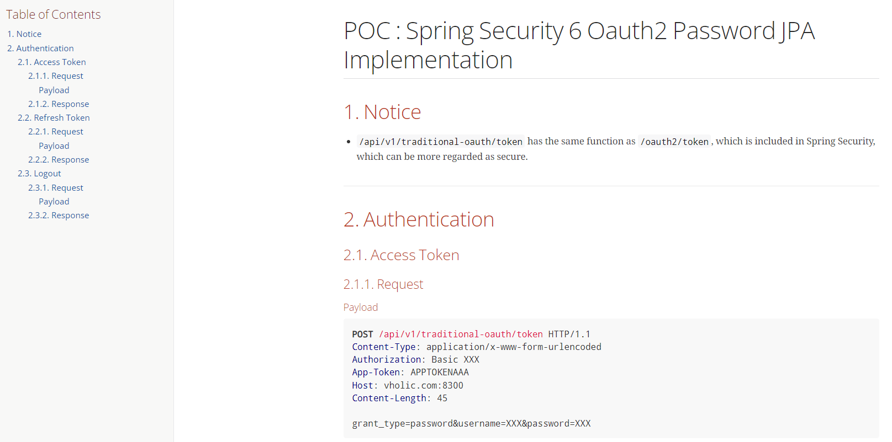

# Spring Security Oauth2 Password JPA Implementation
## Overview

* Complete separation of the library (API) and the client for testing it
```xml
<dependency>
    <groupId>io.github.patternknife.securityhelper.oauth2.api</groupId>
    <artifactId>spring-security-oauth2-password-jpa-implementation</artifactId>
    <version>2.6.0</version>
</dependency>
```
* Set up the same access & refresh token APIs on both ``/oauth2/token`` and on our controller layer such as ``/api/v1/traditional-oauth/token``, both of which function same and have `the same request & response payloads for success and errors`. (However, ``/oauth2/token`` is the standard that "spring-authorization-server" provides.)
  * As you are aware, the API ``/oauth2/token`` is what "spring-authorization-server" provides.
    * ``/api/v1/traditional-oauth/token`` is what this library implemented directly.
        * Success Payload
         ```json
          {
              "access_token" : "Vd4x8D4lDg7VBFh...",
              "token_type" : "Bearer",
              "refresh_token" : "m3UgLrvPtXKdy7jiD...",
              "expires_in" : 3469,
              "scope" : "read write"
           }
        ```
      
        * Error Payload (Customizable) 
        ```json
          {
              "timestamp": 1719470948370,
              "message": "Couldn't find the client ID : client_admin", // Sensitive info such as being thrown from StackTraces
              "details": "uri=/oauth2/token",
              "userMessage": "Authentication failed. Please check your credentials.",
              "userValidationMessage": null
          }
        ```

        * In the following error payload, the 'message' shouldn't be exposed to clients; instead, the 'userMessage' should be.
      
* Authentication management based on a combination of username, client ID, and App-Token
  * What is an App-Token? An App-Token is a new access token generated each time the same account logs in. If the token values are the same, the same access token is shared.
* Separated UserDetails implementation for Admin and Customer roles as an example. (This can be extended as desired by implementing ``UserDetailsServiceFactory``)
* Provide MySQL DDL, which consists of oauth\_access\_token, oauth\_refresh\_token and oauth\_client\_details, which is tables in Security 5. As I mean to migrate current security system to Security 6, I haven't changed them to the ``authorization`` table indicated in https://github.com/spring-projects/spring-authorization-server.
* Application of Spring Rest Docs
 
## Dependencies

| Category          | Dependencies                               |
|-------------------|--------------------------------------------|
| Backend-Language  | Java 17                                    |
| Backend-Framework | Spring Boot 3.1.2                          |
| Main Libraries    | Spring Security Authorization Server 1.2.3 |
| Package-Manager   | Maven 3.6.3 (mvnw, Dockerfile)             |
| RDBMS             | Mysql 8.0.17                               |

## Run the App

#### Import the SQL file in the ``mysql`` folder.

#### Install Maven
```shell
mvnw clean install
cd client
mvnw clean install # Integration tests are done here, which creates docs by Spring-Rest-Doc.
```
- Run the client module by running ``SpringSecurityOauth2PasswordJpaImplApplication`` in the client.
- The API information is found on ``http://localhost:8370/docs/api-app.html``, managed by Spring Rest Doc



- In case you use IntelliJ, I recommend creating an empty project and importing the API (root) module and client module separately.
- The client module definitely consumes the API module, but not vice versa.

## API Guide

### **Registration**
  - See the `client` folder. As the Api module consumes JPA, adding it to Beans is required.

```java

// ADD 'io.github.patternknife.securityhelper.oauth2.api'
@SpringBootApplication(scanBasePackages =  {"com.patternknife.securityhelper.oauth2.client", "io.github.patternknife.securityhelper.oauth2.api"})
public class SpringSecurityOauth2PasswordJpaImplApplication {

    public static void main(String[] args) {
        SpringApplication.run(SpringSecurityOauth2PasswordJpaImplApplication.class, args);
    }

}
```

```java
@Configuration
// ADD 'io.github.patternknife.securityhelper.oauth2.api.config.security'
@EnableJpaRepositories(
        basePackages = {"com.patternknife.securityhelper.oauth2.client.domain",
                "com.patternknife.securityhelper.oauth2.client.config.securityimpl",
                "io.github.patternknife.securityhelper.oauth2.api.config.security"},
        entityManagerFactoryRef = "commonEntityManagerFactory",
        transactionManagerRef= "commonTransactionManager"
)
public class CommonDataSourceConfiguration {
    

   // ADD 'io.github.patternknife.securityhelper.oauth2.api.config.security'
    @Primary
    @Bean(name = "commonEntityManagerFactory")
    public LocalContainerEntityManagerFactoryBean commonEntityManagerFactory(EntityManagerFactoryBuilder builder) {
        return builder
                .dataSource(commonDataSource())
                .packages("com.patternknife.securityhelper.oauth2.client.domain",
                        "io.github.patternknife.securityhelper.oauth2.api.config.security")
                .persistenceUnit("commonEntityManager")
                .build();
    }

}
```

### **Implementation of...**

#### "Mandatory" settings
  - The only mandatory setting is ``client.config.securityimpl.service.userdetail.CustomUserDetailsServiceFactory``. The rest depend on your specific situation.

#### "Customizable" settings

  - **Use PointCut when events happen such as tokens created**
    - ``SecurityPointCut``
    - See the source code in ``client.config.securityimpl.aop`` 
  - **Register error user messages as desired**
    - ``ISecurityUserExceptionMessageService``
    - See the source code in ``client.config.securityimpl.message``
  - **Customize the whole error payload as desired for all cases**
    - What is "all cases"?
      - Authorization Server ("/oauth2/token", "/api/v1/traditional-oauth/token") and Resource Server (Bearer token inspection : 401, Permission : 403)
    - Customize two points such as
      - ``client.config.securityimpl.response.CustomAuthenticationFailureHandlerImpl`` ("/oauth2/token")
      - ``client.config.response.error.GlobalExceptionHandler`` ("/api/v1/traditional-oauth/token", Resource Server (Bearer token inspection))
      - ``client.config.securityimpl.response.CustomAuthenticationEntryPointImpl`` (Resource Server (Bearer token inspection : 401)) 
      - ``client.config.securityimpl.response.CustomAccessDeniedHandlerImpl`` (Resource Server (Permission inspection : 403)) 
  - **Customize the whole success payload as desired for the only "/oauth2/token"**
      - ``client.config.securityimpl.response.CustomAuthenticationSuccessHandlerImpl``
      - The success response payload of "/api/v1/traditional-oauth/token" is in ``api.domain.traditionaloauth.dto``, which doesn't yet to be customizable.  

## Running this App with Docker
* Use the following module for Blue-Green deployment:
  * https://github.com/patternknife/docker-blue-green-runner
* The above module references this app's Dockerfile and the entrypoint script in the .docker folder.