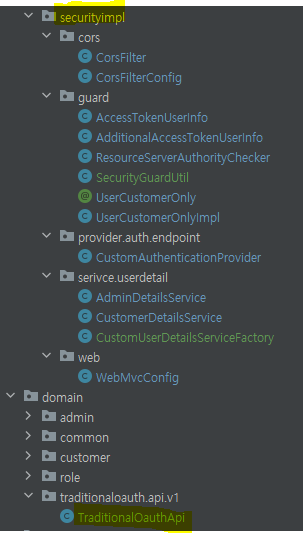

# POC : Spring Security Oauth2 Password JPA Implementation
## Overview

* In the Spring Security 6 ecosystem, compared to 5, there is a preference for JWT or Keycloak over traditional OAuth2 using a Password Grant method with Spring Security Authorization and Resource Server. I needed to incorporate the current OAuth2 Password Grant with the Spring Security new version and am showing the customization.
  * Set up access & refresh token APIs on both '/oauth2/token' and on our controller layer such as '/api/v1...', both of which function same and have `the same request & response payloads for success and errors`.
    * In the following error payload, the 'message' shouldn't be exposed to clients; instead, the 'userMessage' should be.
      ````
      {
        "timestamp": 1719470948370,
        "message": "Couldn't find the client ID : client_admi",
        "details": "uri=/oauth2/token",
        "userMessage": "Authentication failed. Please check your credentials.",
        "userValidationMessage": null
      }
      ````
  * Authentication management based on a combination of username, client id, and an extra token (referred to in the source code as App-Token, which receives a unique value from the calling devices).
  * Separated UserDetails implementation for Admin and Customer roles.
  * Integration with spring-security-oauth2-authorization-server.
   * Provide MySQL DDL, which consists of oauth\_access\_token, oauth\_refresh\_token and oauth\_client\_details, which is tables in Security 5. As I mean to migrate current security system to Security 6, I haven't changed them to the ``authorization`` table indicated in https://github.com/spring-projects/spring-authorization-server.
  * Application of Spring Rest Docs. 
 
## Dependencies

| Category          | Dependencies                               |
|-------------------|--------------------------------------------|
| Backend-Language  | Java 17                                    |
| Backend-Framework | Spring Boot 3.1.2                          |
| Main Libraries    | Spring Security Authorization Server 1.2.3 |
| Package-Manager   | Maven 3.6.3 (mvnw, Dockerfile)             |
| RDBMS             | Mysql 8.0.17                               |

## Run the App

#### Import the SQL file in the ``mysql`` folder.

#### Install Maven
```shell
mvnw clean install
cd client
mvnw clean install # Integration tests are done here, which creates docs by Spring-Rest-Doc.
```
- Run the client module by running ``SpringSecurityOauth2PasswordJpaImplApplication`` in the client.
- The API information is found on ``http://localhost:8370/docs/api-app.html``, managed by Spring Rest Doc


- In case you use IntelliJ, I recommend creating an empty project and importing the API (root) module and client module separately.
- The client module definitely consumes the API module, but not vice versa.

## Implementation of the Api
### The implementation method is shown in the client source code.

- **Registration**
  - As the Api consumes JPA, adding it to Beans is required.

```java

// ADD 'com.patternknife.securityhelper.oauth2.api'
@SpringBootApplication(scanBasePackages =  {"com.patternknife.securityhelper.oauth2.client", "com.patternknife.securityhelper.oauth2.api"})
public class SpringSecurityOauth2PasswordJpaImplApplication {

    public static void main(String[] args) {
        SpringApplication.run(SpringSecurityOauth2PasswordJpaImplApplication.class, args);
    }

}
```

```java
@Configuration
// ADD 'com.patternknife.securityhelper.oauth2.api.config.security'
@EnableJpaRepositories(
        basePackages = {"com.patternknife.securityhelper.oauth2.client.domain",
                "com.patternknife.securityhelper.oauth2.client.config.securityimpl",
                "com.patternknife.securityhelper.oauth2.api.config.security"},
        entityManagerFactoryRef = "commonEntityManagerFactory",
        transactionManagerRef= "commonTransactionManager"
)
public class CommonDataSourceConfiguration {
    

   // ADD 'com.patternknife.securityhelper.oauth2.api.config.security'
    @Primary
    @Bean(name = "commonEntityManagerFactory")
    public LocalContainerEntityManagerFactoryBean commonEntityManagerFactory(EntityManagerFactoryBuilder builder) {
        return builder
                .dataSource(commonDataSource())
                .packages("com.patternknife.securityhelper.oauth2.client.domain",
                        "com.patternknife.securityhelper.oauth2.api.config.security")
                .persistenceUnit("commonEntityManager")
                .build();
    }

}
```

- **Implementation**
  - In fact, the only mandatory settings are 'CustomAuthenticationProvider' and 'CustomUserDetailsServiceFactory'. The rest depend on your specific situation.
  



### Running this App with Docker
* Use the following module for Blue-Green deployment:
  * https://github.com/patternknife/docker-blue-green-runner
* The above module references this app's Dockerfile and the entrypoint script in the .docker folder.