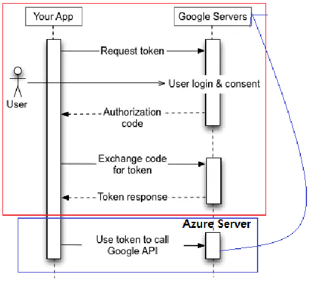

= Restful API (for Customers)
:doctype: book
:icons: font
:source-highlighter: highlightjs
:toc: left
:toclevels: 4
:sectnums:
:sectlinks:
:sectanchors:

**개발된 모든 API 는 여기를 우선적으로 참조하시되, [.line-through]#없는 것은 상호 공유 한 엑셀 시트를 참고**해 주시기 부탁드립니다.#
->  **모든 API 는 이 곳에서 확인해주십시오.**
왜냐하면, 저희가 수정 사항이 발생하면, 엑셀 시트를 업데이트 하지만, 혹시 놓치게 되거나, 변경 사항들로 인해 코드와 불일치 하게 될 수 있습니다.

NOTE: 해당 문서는 하기 '1.공통' 을 제외하고는 작성된 Controller 레이어의 Test Code 가 있는 소스에 한해 자동으로 생성되므로, 별도의 조치 없이 **현재 소스와 문서가 일치**합니다. ( 참고 : https://spring.io/projects/spring-restdocs ).

[[api]]
== 공통
- Restful API (for Customers, Dashboard) 전체에 해당
- Content-Type 은 항상 'application/json'

=== 성공
모든 성공 response (2xx, 현재는 200 만 존재) 는 항상 예외 없이 다음 Payload 를 따른다.
[source,options="nowrap"]
----
{
  "timestamp" : "2023-11-01T01:50:40.037+0000",
  "details" : "/api/v1/binders",

  "data" : "<--각 API 들에 따라 다양한 Type 이 올 수 있음-->",
}
----

=== 실패
모든 실패 response (200 제외) 는 항상 다음 Payload 를 따른다. [.line-through]#(단, oauth/token API 의 인증 관련 오류 처리는 약간 상이함이 있으며, 동일하게 반영 예정이다.)# -> 반영 완료.

[source,options="nowrap"]
----
※ 처리 되지 않은 (Unhandled) 오류 (항상 Status Code 는 500)
{
    "timestamp": "2023-10-23T03:59:59.357+0000",
    "details": "uri=/api/v1/clinics",

    "message": "",   // 이 메시지는 StackTrace를 포함하고 있어 보안상 production에서 클라이언트에 빈 값으로 전달됩니다.
    "userMessage": "처리되지 않은 오류 입니다.",
    "userValidationMessage": null,
}

※ 처리 된 (Handled) 오류 (500(처리 되지 않은 오류)을 제외 한 모든 오류 코드.)
{
    "timestamp": "2023-10-23T03:41:53.424+0000",
    "details": "uri=/api/v1/customer/create",

    "message": "could not execute statement; SQL [n/a]; constraint [customer.email]; nested exception is org.hibernate.exception.ConstraintViolationException: could not execute statement",
            // 이 메시지는 StackTrace를 포함할 수도 있어, 보안상 production에서 클라이언트에 빈 값으로 전달됩니다.
    "userMessage": null,
    "userValidationMessage": {
        "email": "이미 등록된 이메일이 있습니다."
    }
}

----

- "userMessage" 는 호출한 API 에 해당하며, "userValidationMessage" 호출한 API 의 클라이언트가 전달한 **개별 파라매터**에 해당한다.

IMPORTANT: 클라이언트의 처리 방법

결론적으로 Http Status 관계없이, userMessage 파라매터의 값이 있으면, 이를 안내 창으로 띄우고, 없을 경우 userValidationMessage 의 key, value 값에서 value 값을 해당 key value 에 해당하는 창에 표시하거나, 안내 창으로 띄운다.

|===
| Http Status | 용도

| 422 (Unprocessable Entity)| 유효성 검사 (예시. 비밀번호는 7자 이상의.. 이메일은 올바른..)
| 401 (Unauthorized), 403 (Forbidden) | 인증, 권한 (예시. 상위 관리자에게 권한을 요청하십시오)
| 404 (Not Found)| 필요 값이 DB 에 없음
| 500 (Internal Server Error) 을 제외한 기타 | 처리 된 오류 (예시. 내부 빈 값으로 처리에 문제가 발생하였습니다.)
| 500 (Internal Server Error) | 처리되지 않은 오류 (예시. 항상 "처리되지 않은 오류 입니다." 로 출력)  | 클라이언트 개발자에게 어떤 정보도 제공되지 않음. Stack 정보를 항상 포함하기 때문에 로그로만 확인 가능
|===

== 인증

화면 : 2_로그인

인증은 표준 Oauth2 의 'Resource Owner Password Credentials Grant (link:https://velog.io/@wooyoung-tom/oauth[Link 의 3 번째]) 방식을 사용합니다.

해당 API 를 사용하기 위해서는, 서버 측에 client_id, client_secret, username, password 를 문의하십시오. username 과 password 는 개별 사용자들의 로그인 정보이며, 이 중 username 은 현재 사용자의 email 인데, id 로 변경 예정입니다.

=== Access Token 요청 (일반 로그인)
==== Request
===== Payload
include::{snippets}/customer-integration-test/test_같은_앱토큰_끼리는_같은_액세스_토큰을_사용/oauth-access-token/http-request.adoc[]
====== Header
include::{snippets}/customer-integration-test/test_같은_앱토큰_끼리는_같은_액세스_토큰을_사용/oauth-access-token/request-headers.adoc[]
====== Parameters
include::{snippets}/customer-integration-test/test_같은_앱토큰_끼리는_같은_액세스_토큰을_사용/oauth-access-token/form-parameters.adoc[]
====== Body
'application/x-www-form-urlencoded' 방식이므로 없습니다.

==== Response
include::{snippets}/customer-integration-test/test_같은_앱토큰_끼리는_같은_액세스_토큰을_사용/oauth-access-token/response-body.adoc[]

=== Refresh Token 요청

상기 access_token 이 만료되면 호출

==== Request
===== Payload
include::{snippets}/customer-integration-test/test_같은_앱토큰_끼리는_같은_액세스_토큰을_사용/oauth-refresh-token/http-request.adoc[]
====== Header
include::{snippets}/customer-integration-test/test_같은_앱토큰_끼리는_같은_액세스_토큰을_사용/oauth-refresh-token/request-headers.adoc[]
====== Parameters
include::{snippets}/customer-integration-test/test_같은_앱토큰_끼리는_같은_액세스_토큰을_사용/oauth-refresh-token/form-parameters.adoc[]
====== Body
'application/x-www-form-urlencoded' 방식이므로 없습니다.

==== Response
include::{snippets}/customer-integration-test/test_같은_앱토큰_끼리는_같은_액세스_토큰을_사용/oauth-refresh-token/response-body.adoc[]

=== 로그 아웃

하기 Header 의 access_token 을 만료 시킴

==== Request
===== Payload
include::{snippets}/customer-integration-test/test_같은_앱토큰_끼리는_같은_액세스_토큰을_사용/oauth-customer-logout/http-request.adoc[]
====== Header
include::{snippets}/customer-integration-test/test_같은_앱토큰_끼리는_같은_액세스_토큰을_사용/oauth-customer-logout/request-headers.adoc[]
====== Parameters

없음

====== Body

없음

==== Response
include::{snippets}/customer-integration-test/test_같은_앱토큰_끼리는_같은_액세스_토큰을_사용/oauth-customer-logout/response-body.adoc[]
include::{snippets}/customer-integration-test/test_같은_앱토큰_끼리는_같은_액세스_토큰을_사용/oauth-customer-logout/response-fields.adoc[]

=== 소셜 로그인 개괄

- KAKAO, NAVER, GOOGLE 의 앱 소셜 로그인은 표준 Oauth2 의 'Authorization Code Grant' (link:https://velog.io/@wooyoung-tom/oauth[Link 의 1 번째]) 방식을 사용하며, 이는 아래 이미지의 빨간색 부분에 해당됩니다.
- APPLE 은 'Authorization Code Grant' 전 과정을 WebView 에서 구현합니다.
- 아래에 빨간 색 부분은 앱과 소셜 로그인 Provider 가 단독적으로 진행합니다.
- 앱은 소셜 로그인 Provider 로 부터 최종적으로 얻은 Access Token (이는 가변적. 사용자가 재로그인하면 바뀜.) 와 함께 웹 Server 를 호출하면, 웹 서버에서는 해당 Access Token 으로 Provider 를 호출해서, Access Token 의 사용자 키(ID 또는 EMAIL)를 확인하고, 회원 가입 된 사용자면 웹 서버의 Access Token 을 발급하고, 이 후 이를 가지고 통신한다.
- 아래 2.4 부터는 하기 파란색 박스에 해당하는 Provider 별 웹 서버 호출에 대해 기술되어 있다.

=== Access Token 요청 (소셜 로그인, 카카오)

- 앱 개발자의 SDK 사용을 위해, 개발팀은 NATIVE_APP_KEY 을 제공하고, 카카오 개발자 사이트에서 기타 사전 설정을 완료 한다.

- 앱 개발자는 이제 하기 SDK 사용을 통해, accessToken 을 얻을 수 있다.
https://developers.kakao.com/docs/latest/ko/kakaologin/android#login-with-kakaoaccount

- 위와 같이 사용자의 앱이 카카오 서버로 표준 OAuth2 의 'Authorization Code Grant (link:https://velog.io/@wooyoung-tom/oauth[Link 의 1 번째]) 방식으로, 카카오 화면에서 로그인에 성공하면, 기기의 접근 권한을 최소한 사용자의 email 은 접근 권한은 필수로 해야, 서버에서 **바로 아래 설명할 추가 호출 API**를 통해 accessToken 을 카카오 서버에 요청하여, 사용자의 email 주소를 알아내서, 해당 email 이 1) DB social 컬럼에 없다면, API 는 하기 Exception 을 Response 하여, 회원 생성 (소셜 로그인, 카카오) API 를 호출하게 한다. 2) DB에 있다면, 상기 일반 로그인과 동일한 Response 를 최종적으로 앱에 전달한다.

- 가져온 카카오 accessToken 은 다음 하기 **추가 호출**로, 앱에서 접근 권한이 있는 자원들에 API 를 호출할 수 있는 accessToken 과 refreshToken 을 얻게 된다.

==== Request
===== Payload
include::{snippets}/social-oauth-api-test/create-access-token-using-ka-kao-token_200/http-request.adoc[]

====== Parameters
없음

====== Body
include::{snippets}/social-oauth-api-test/create-access-token-using-ka-kao-token_200/request-body.adoc[]
include::{snippets}/social-oauth-api-test/create-access-token-using-ka-kao-token_200/request-fields.adoc[]

==== Error Response
IMPORTANT: 아래 userMessage 를 화면에 출력하고, https://vholic.com:3100/auth/kt-pass/me 페이지를 인 웹으로 띄운다.

include::{snippets}/social-oauth-api-test/create-access-token-using-ka-kao-token_-no-social-registered-exception_401/response-body.adoc[]
include::{snippets}/social-oauth-api-test/create-access-token-using-ka-kao-token_-no-social-registered-exception_401/response-fields.adoc[]

==== Response
include::{snippets}/social-oauth-api-test/create-access-token-using-ka-kao-token_200/response-body.adoc[]
include::{snippets}/social-oauth-api-test/create-access-token-using-ka-kao-token_200/response-fields.adoc[]

=== 회원 생성 (소셜 로그인, 카카오)
==== Request
===== Payload
include::{snippets}/social-oauth-api-test/create-kakao-social-customer_200/http-request.adoc[]
====== Header
없음

====== Body
include::{snippets}/social-oauth-api-test/create-kakao-social-customer_200/request-body.adoc[]
include::{snippets}/social-oauth-api-test/create-kakao-social-customer_200/request-fields.adoc[]

==== Response
include::{snippets}/social-oauth-api-test/create-kakao-social-customer_200/response-body.adoc[]
include::{snippets}/social-oauth-api-test/create-kakao-social-customer_200/response-fields.adoc[]

=== Access Token 요청 (소셜 로그인, 네이버)

- 앱 개발자의 SDK 사용을 위해, 개발팀은 NATIVE_APP_KEY 을 제공하고, 네이버 개발자 사이트에서 기타 사전 설정을 완료 한다.

- 앱 개발자는 이제 하기 SDK 사용을 통해, accessToken 을 얻을 수 있다.
https://developers.naver.com/docs/login/sdks/sdks.md

- 이 부분은 상기 카카오와 동일
- 이 부분은 상기 카카오와 동일

==== Request
===== Payload
include::{snippets}/social-oauth-api-test/create-access-token-using-naver-token_200/http-request.adoc[]

====== Parameters
없음

====== Body
include::{snippets}/social-oauth-api-test/create-access-token-using-naver-token_200/request-body.adoc[]
include::{snippets}/social-oauth-api-test/create-access-token-using-naver-token_200/request-fields.adoc[]

==== Response
include::{snippets}/social-oauth-api-test/create-access-token-using-naver-token_200/response-body.adoc[]
include::{snippets}/social-oauth-api-test/create-access-token-using-naver-token_200/response-fields.adoc[]

==== Error Response
IMPORTANT: 상기 카카오와 동일

=== 회원 생성 (소셜 로그인, 네이버)
==== Request
===== Payload
include::{snippets}/social-oauth-api-test/create-naver-social-customer_200/http-request.adoc[]
====== Header
없음

====== Body
include::{snippets}/social-oauth-api-test/create-naver-social-customer_200/request-body.adoc[]
include::{snippets}/social-oauth-api-test/create-naver-social-customer_200/request-fields.adoc[]

==== Response
include::{snippets}/social-oauth-api-test/create-naver-social-customer_200/response-body.adoc[]
include::{snippets}/social-oauth-api-test/create-naver-social-customer_200/response-fields.adoc[]

=== Access Token 요청 (소셜 로그인, 구글)

- 앱 개발자의 SDK 사용을 위해, 개발팀은 구글 Client ID 를 전달한다.

- 이 부분은 상기 카카오와 동일
- 이 부분은 상기 카카오와 동일

==== Request
===== Payload
include::{snippets}/social-oauth-api-test/create-access-token-using-google-token_200/http-request.adoc[]

====== Parameters
없음

====== Body
include::{snippets}/social-oauth-api-test/create-access-token-using-google-token_200/request-body.adoc[]
include::{snippets}/social-oauth-api-test/create-access-token-using-google-token_200/request-fields.adoc[]

==== Response
include::{snippets}/social-oauth-api-test/create-access-token-using-google-token_200/response-body.adoc[]
include::{snippets}/social-oauth-api-test/create-access-token-using-google-token_200/response-fields.adoc[]

==== Error Response
IMPORTANT: 상기 카카오와 동일

=== 회원 생성 (소셜 로그인, 구글)
==== Request
===== Payload
include::{snippets}/social-oauth-api-test/create-google-social-customer_200/http-request.adoc[]
====== Header
없음

====== Body
include::{snippets}/social-oauth-api-test/create-google-social-customer_200/request-body.adoc[]
include::{snippets}/social-oauth-api-test/create-google-social-customer_200/request-fields.adoc[]

==== Response
include::{snippets}/social-oauth-api-test/create-google-social-customer_200/response-body.adoc[]
include::{snippets}/social-oauth-api-test/create-google-social-customer_200/response-fields.adoc[]

=== Access Token 요청 (소셜 로그인, 애플)

- 애플 소셜 로그인은 몇몇 제약 사항들로 인해 WebView 로 구현

==== Request
===== Payload
- 웹 뷰를 띄우면서, HttpRequest 로 https://vholic.com:8300/social-oauth/apple/login 에 접속한다.

==== Response
- Android
+
다음 프로토콜을 활성화 해주세요.
+
[source,options="nowrap"]
----
private class WebToAppInterface  {

    @JavascriptInterface
    public void sendTokenInfo(String queryString) {
        /* queryString 을 역직렬화 (Deserialization) 하여 사용하십시오. 형식은 아래와 같습니다. 해당 access_token 으로 통신하십시오.
             {
                 "token_type" : "Bearer",
                  "access_token" : "aaa",
                  "refresh_token" : "bbb",
                  "expires_in" : 36000,
                  "scope" : "read,write",
                  "just_now_created" : true,
                  "password_registered" : true
             } */
    }

}
----
- IOS
+
'sendTokenInfo' 함수 등록요망
+
----
window.webkit.messageHandlers.sendTokenInfo.pushMessage(queryString);
----

==== Error Response
IMPORTANT: 다른 소셜 로그인들과 다른 점은, 사용자가 회원가입이 안되어있을 경우, WebView 를 서버에서 구현하였으므로, 서버에서 자체적으로 https://vholic.com:3100/auth/kt-pass/me 페이지로 redirect 한다. (IOS 할 일 X)

=== 회원 생성 (소셜 로그인, 애플)
==== Request
===== Payload
- 아래 idToken 의 경우 애플 로그인의 필수 값이며, 애플 로그인은 웹 뷰에서 처리하므로, accessToken을 전달하지 않는다. (idToken은 https://vholic.com:3100/auth/kt-pass/me 에서 종료하면서 전달하였다.)

include::{snippets}/social-oauth-api-test/create-apple-social-customer_200/http-request.adoc[]
====== Header
없음

====== Body
include::{snippets}/social-oauth-api-test/create-apple-social-customer_200/request-body.adoc[]
include::{snippets}/social-oauth-api-test/create-apple-social-customer_200/request-fields.adoc[]

==== Response
include::{snippets}/social-oauth-api-test/create-apple-social-customer_200/response-body.adoc[]
include::{snippets}/social-oauth-api-test/create-apple-social-customer_200/response-fields.adoc[]
